# supershop

A new open source E-commerce App created using Flutter, API and Bloc as State Management.

# Features :

* Sign-In, Sign-Up and LogOut.
* Using Clean Architecture, Custom widgets and Clean reusable code.
* Using Bloc as a state management.
* Using API.
* Support Localization.
* Using Responsive UI (soon).

## Screen Shots
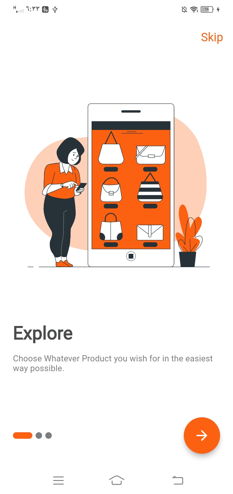 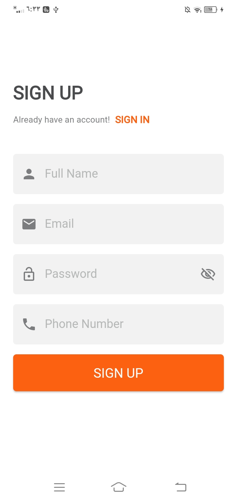
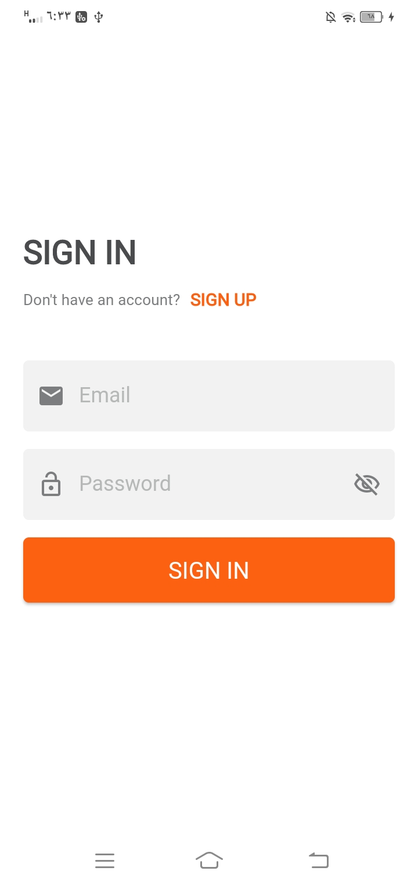 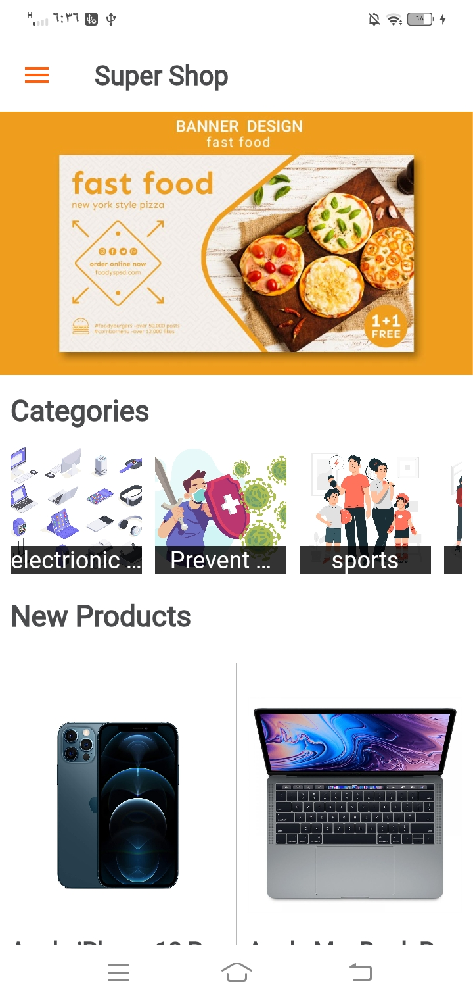
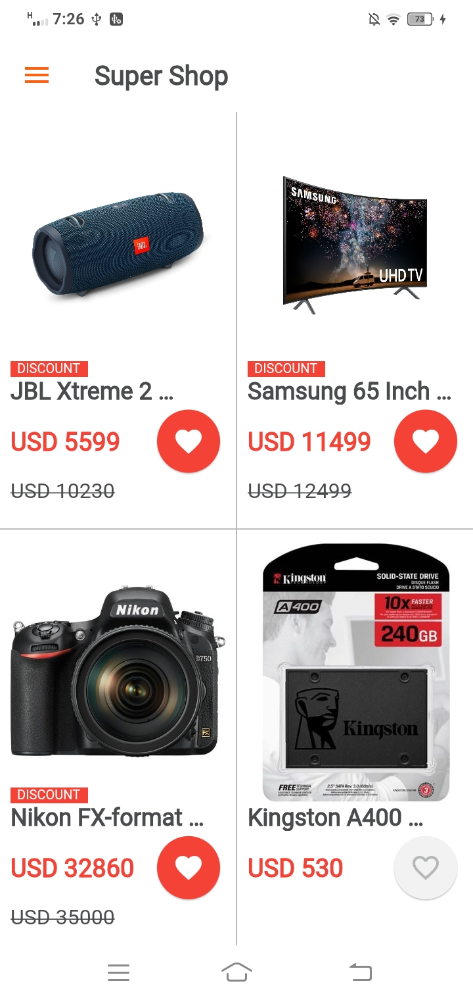 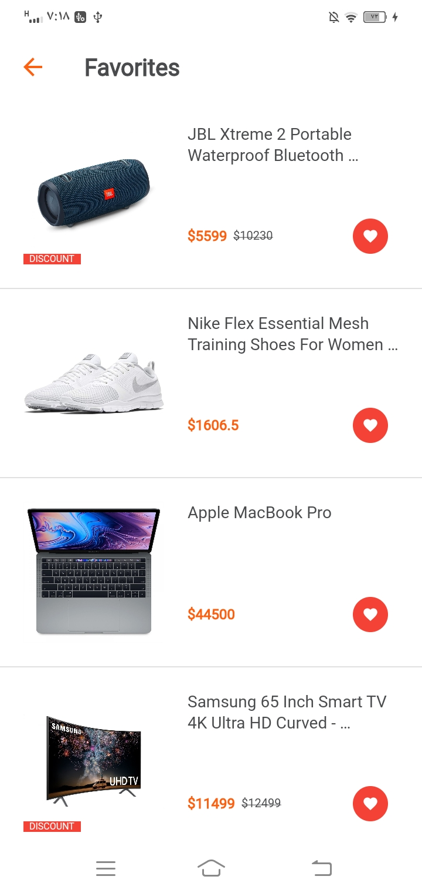
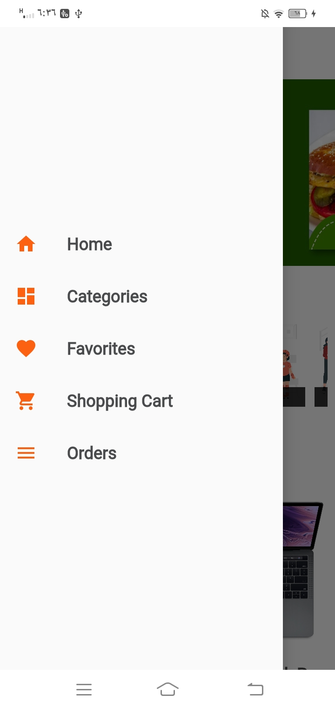 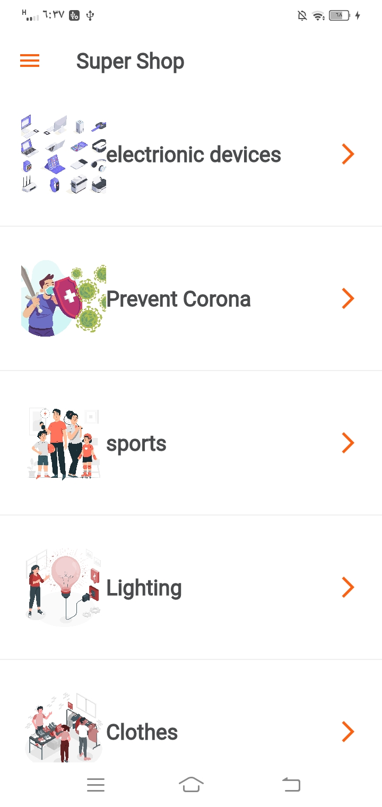
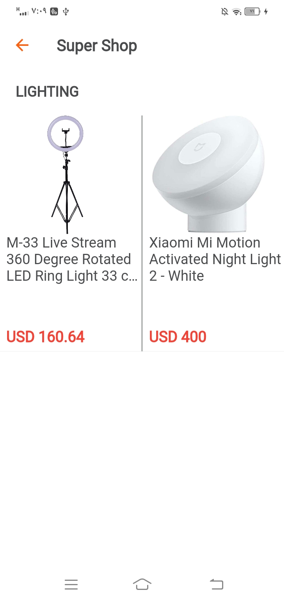 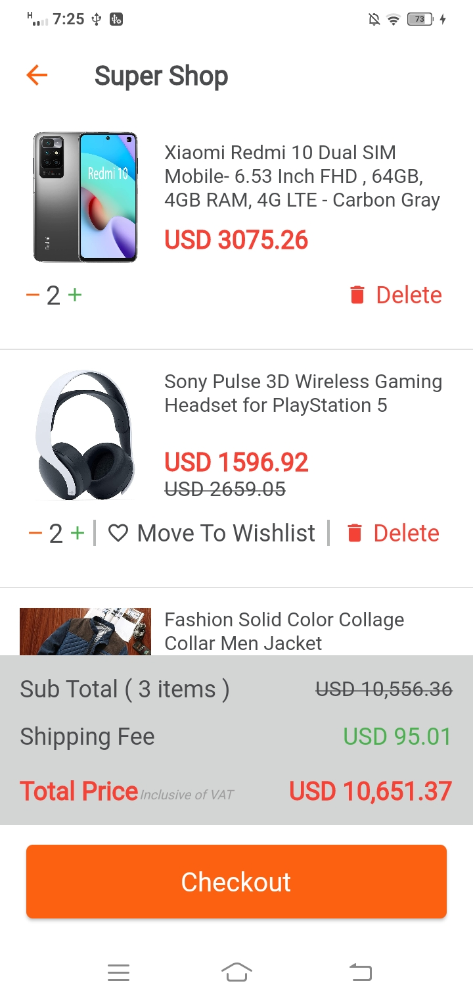
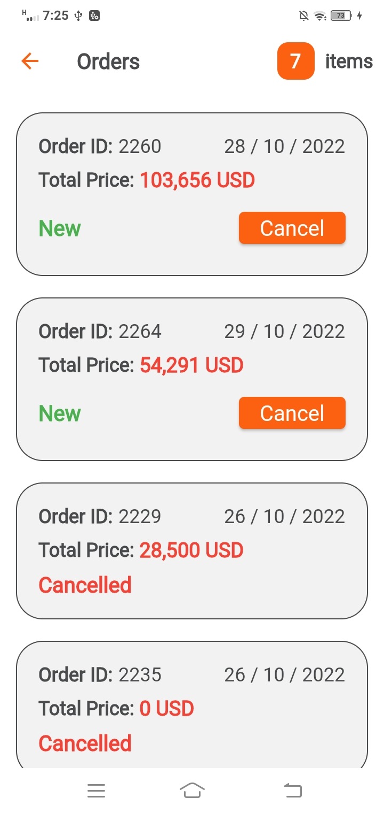

Give a ⭐️ if you like the project.. Thanks!
